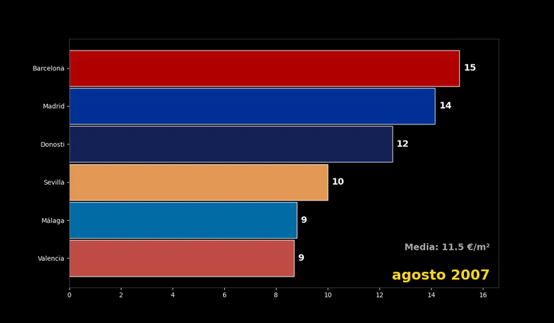

# precio-alquiler-es

Demo de gráfico animado mostrando la evolución del precio del alquiler de vivienda en España

## 📊 Datos
- **Fuente**: [Idealista - Informes precio vivienda](https://www.idealista.com/sala-de-prensa/informes-precio-vivienda/alquiler/)
- **Período**: 2008 - Agosto 2025
- **Ciudades**: Valencia, Donosti, Madrid, Barcelona, Málaga, Sevilla
- **Actualización**: Datos actualizados a agosto 2025

## 🎬 Visualización



## 🚀 Mejoras implementadas (2025)

### 1. **Tema oscuro profesional**
- Fondo negro puro para mejor contraste
- Texto en blanco de alta legibilidad
- Grid sutil para guía visual

### 2. **Colores distintivos por ciudad**
- Valencia: `#D4574E` (rojizo)
- Donosti: `#172863` (azul oscuro)
- Madrid: `#0038A8` (azul medio)
- Barcelona: `#C80000` (rojo)
- Málaga: `#007AB8` (azul claro)
- Sevilla: `#FFAB60` (naranja)

### 3. **Información adicional**
- Fecha actual destacada en dorado
- Media de precios en tiempo real
- Etiquetas de ciudades más grandes y legibles
- Soporte para fechas en español

### 4. **Optimizaciones técnicas**
- Animación más fluida (8 pasos por período)
- Interpolación de datos faltantes
- Manejo robusto de valores `n.d.`
- Compatible con `bar_chart_race` última versión

## 🛠️ Instalación

```bash
# Instalar dependencias
pip install pandas matplotlib bar-chart-race

# Ejecutar el script
python bar_chart_race_alquileres.py
```

## 📁 Archivos

- `bar_chart_race_alquileres.py` - Script principal con todas las mejoras
- `alquileres_race.gif` - Animación GIF resultante
- `2025 alquileres - Todos.csv` - Datos actualizados (necesario para ejecutar el script)

## 📈 Características del script

- **Configuración automática del tema oscuro**
- **Procesamiento inteligente de datos** (limpieza, interpolación)
- **Localización española** (meses en español si está disponible)
- **Generación flexible** (MP4 o GIF)
- **Colores personalizados por ciudad**

## 🔧 Personalización

El script permite personalizar fácilmente:
- Colores de las ciudades (diccionario `color_dict`)
- Velocidad de animación (`steps_per_period`, `period_length`)
- Resolución y calidad (`dpi`, `figsize`)
- Formato de salida (MP4/GIF)

---
*Versión original por arin-apin | Mejoras 2025 implementadas*