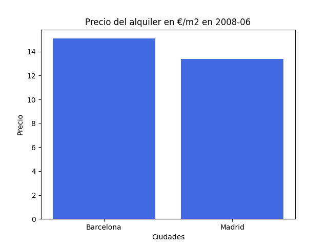

# precio-alquiler-es
demo sencilla de grafico animado mostrando la evolución del precio del alquiler de vivienda en españa 
el código es muy sencillo 
los datos han sido sacados el 17/12/2023 de [https://www.idealista.com/sala-de-prensa/informes-precio-vivienda/alquiler/](https://www.idealista.com/sala-de-prensa/informes-precio-vivienda/alquiler/) 
copiando y pegando en un google spreadsheet y exportando a csv  
  
resultado: 

