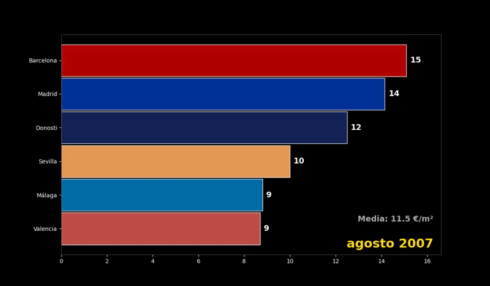

# precio-alquiler-es

Evolución del precio del alquiler de vivienda en España (€/m²), visualizada como un bar chart race animado.

## 📊 Datos

- **Fuente**: [Idealista - Informes precio vivienda](https://www.idealista.com/sala-de-prensa/informes-precio-vivienda/alquiler/)
- **Período**: 2008 - Marzo 2026
- **Ciudades**: Valencia, Donosti, Madrid, Barcelona, Málaga, Sevilla
- **Actualización**: Datos actualizados a marzo 2026

## 🎬 Visualización



## 🛠️ Uso

```bash
# Dependencias
pip install pandas numpy matplotlib

# Ejecutar
python generar_animacion.py
```

Requiere `ffmpeg` instalado en el sistema.

## 📁 Archivos

- `generar_animacion.py` — script principal
- `alquileres_race_v4.mp4` — animación completa en vídeo
- `alquileres_race.gif` — muestra animada (fragmento central)
